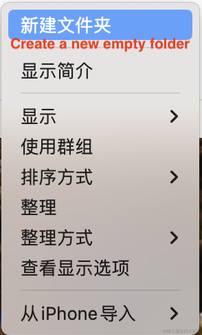

<p align="center">
  <a href="README_CN.md">中文文档</a>
</p>

# Preface

Current case Flutter SDK version: **3.13.2**

Currently Flutter is in one project, **creating different directories** for **module development**. When I was doing **Android native development**, I found that on the native side, **each module can be run independently* *Get up, the inspiration comes from this;

<br/>


# 1、Create root directory

Create a new empty folder, I named it `flutter_module_develop`;




# 2、Create module

Just create a Flutter project in the `flutter_module_develop` folder;
  
### 2.1、Create main module

It is named **app**. I named it according to the native Android one. You can customize this name;


### 2.2、Create submodule

Named **home**, **order**, **personal**, **common**;


# 3.1、Create startup files for each module
Use the development tool to open the `flutter_module_develop` directory. I am using **AndroidStudio**, and then find the file with **entry function**. What is the **entry function**? That's it, so that each module can be started independently, which is the core of module-by-module development.

```js
void main() {
  runApp(...);
}
```


All modules follow the same creation process and final effect.


# 4、Create dependencies

### 4.1、Add relevant dependent libraries in pubspec.yaml of the common module

I added the `provider` library here;


### 4.2、Add the common module to pubspec.yaml of home, order, and personal


### 4.3、Add the home, order, and personal modules to the pubspec.yaml of the app module


# 5、Provider

Declare **status** in the **common** module so that all modules can find it;

```js
import 'package:flutter/cupertino.dart';

class Counter extends ChangeNotifier {
  int count = 0;

  void compute() {
    count++;
    notifyListeners();
  }
}
```

# 6、Question

### 6.1、Static resources cannot be accessed across modules

I put **pictures** and **fonts** in the common module, thinking that other modules could also reference them, but it turned out that **not possible**;

Because it finds the package path of the startup module by default, and the app module is currently started, so it cannot find the local resource files under the common module;

But I found the **solution direction**. Many of these **Widgets** that load local resources provide the package attribute. Unfortunately, I **did not find the correct way to use it**.


# 7、Precautions

7.1、The dependent modules **change**, and **all associated** modules need to `pub get` again, otherwise the **updated content** will not be found;

7.2、When referencing objects that depend on modules, the **compiler does not prompt** and you need to **manually import the package** (import 'xx/xx.dart'), but fortunately there is a **prompt** when importing the package;

7.3、Android native **gradle** requires **unified version**, **not just Android native**, or **all module native platform** build tools require **unified version**, otherwise Something could go wrong;

7.4、For the Flutter project, the disk space occupied by the computer will become larger, reaching 2.5 times. This should not be a problem, unless it is a large game project with tens of gigabytes. Even if it is doubled, it can be solved by adding a hard disk;

# Summarize

### Project dependency graph


### renderings


### Packing volume

The newly created **single** Flutter project has a packaged volume of `17.4MB`, while the packaged volume of the Flutter project containing five modules in the case is `17.9MB`, which is quite reasonable.


