# 前言

当前案例 Flutter SDK版本：**3.13.2**

目前Flutter都是在一个项目中，**创建不同目录**进行**模块开发**，我进行**Android原生开发**时，发现原生端，是可以将**每个模块独立运行**起来的，灵感来自这；

折腾了几天，终于给**整出来**了。


# 1、创建根目录

新建一个空文件夹，我这里给其命名为 `flutter_module_develop`；


# 2、创建模块

就是在 `flutter_module_develop` 文件夹中，创建Flutter项目；

### 2.1、创建主模块

命名为**app**，我是照着Android原生的来命名的，这个命名大家自定义；

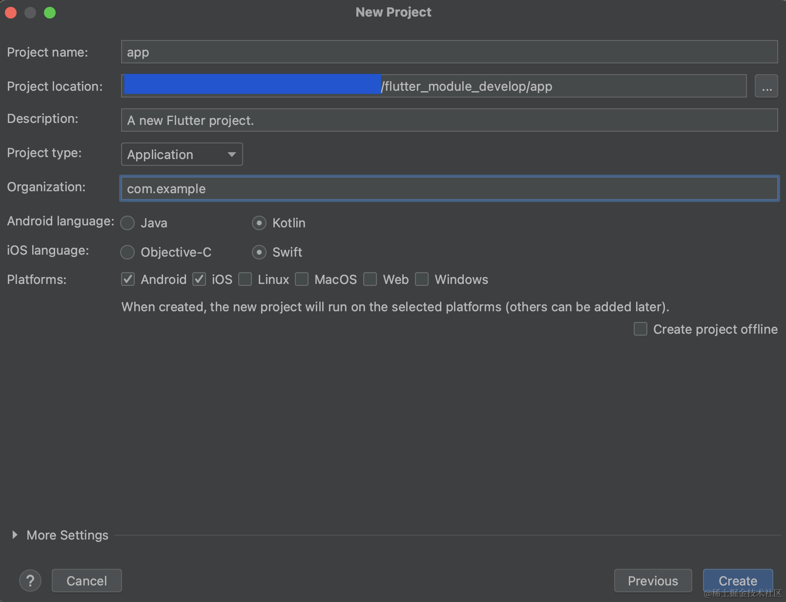

### 2.2、创建子模块

命名为 **home**、**order**、**personal**、**common**；

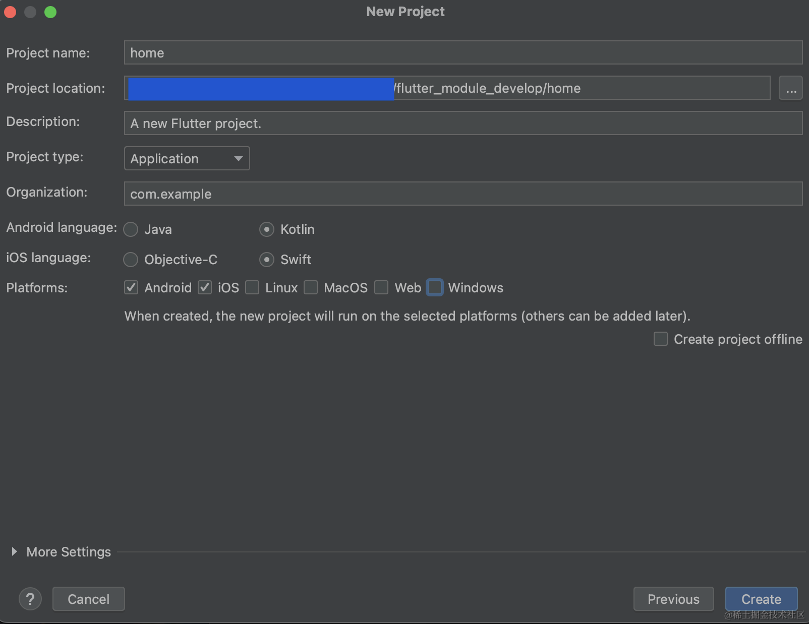

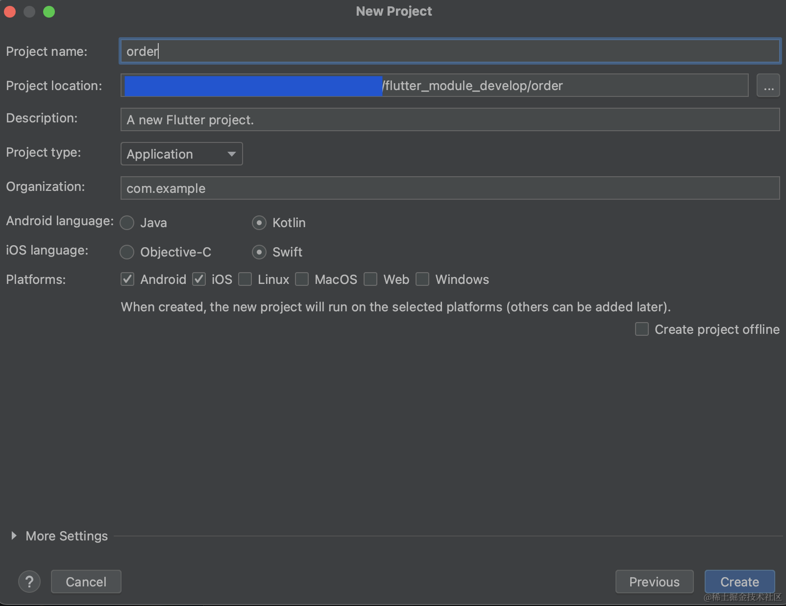

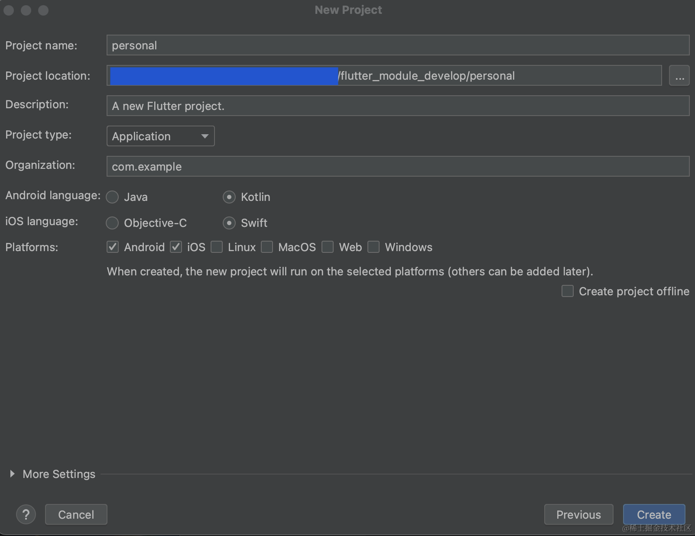

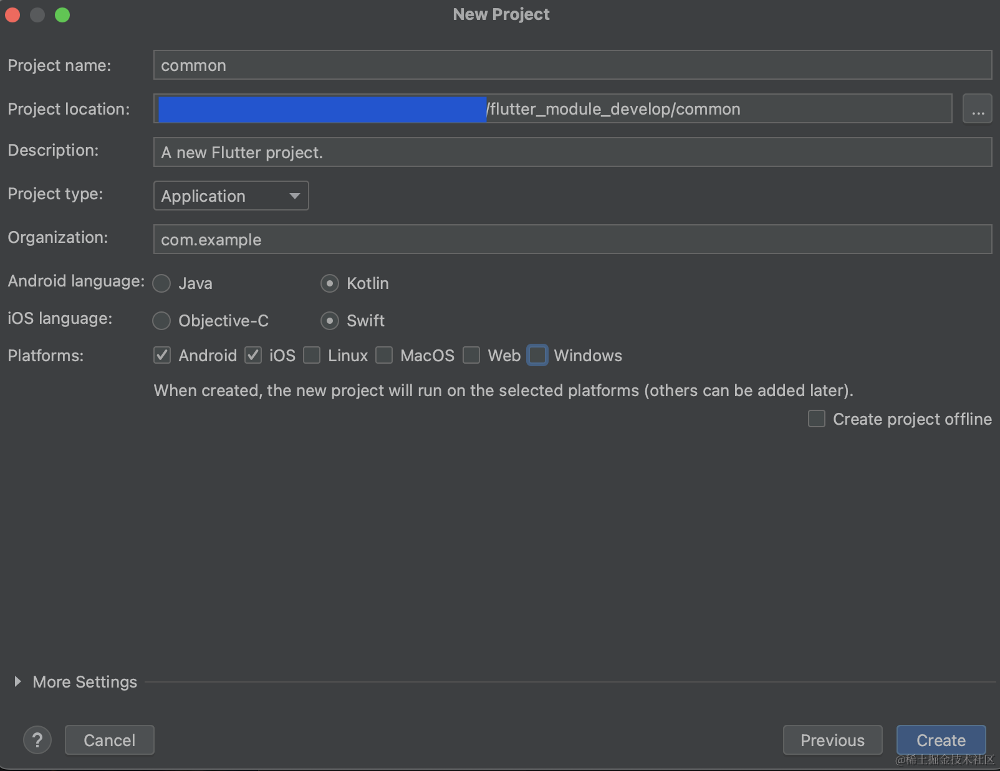

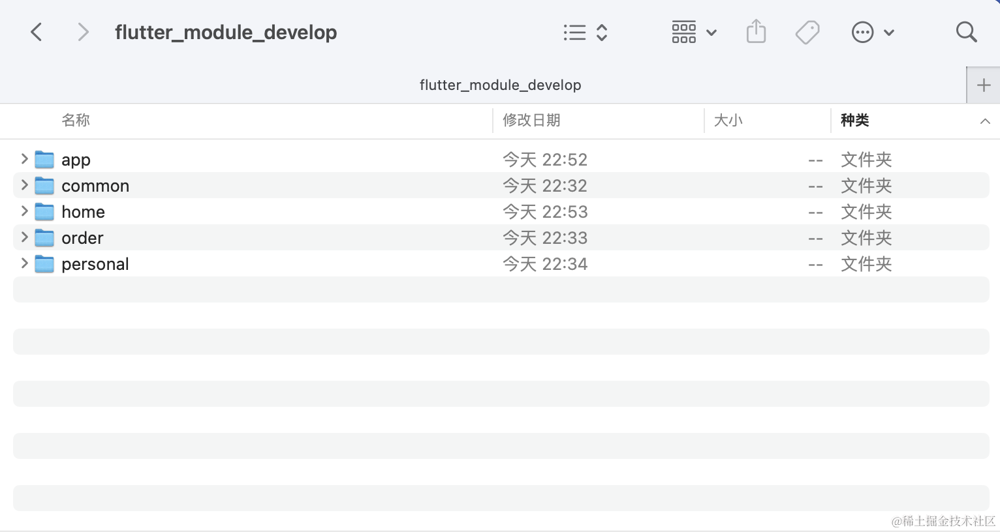

# 3.1、给每个模块创建启动文件
使用开发工具打开 `flutter_module_develop`目录，我使用的是**AndroidStudio**，然后找到有**入口函数**的文件，什么是**入口函数**？就是这玩意，这样**每个模块都可以独立启动**，算是分模块开发的**核心**。

```js
void main() {
  runApp(...);
}
```
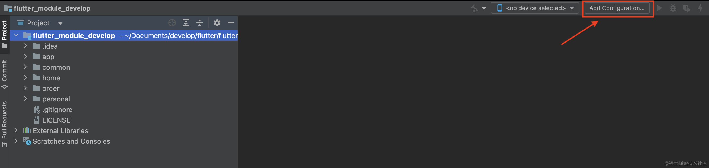

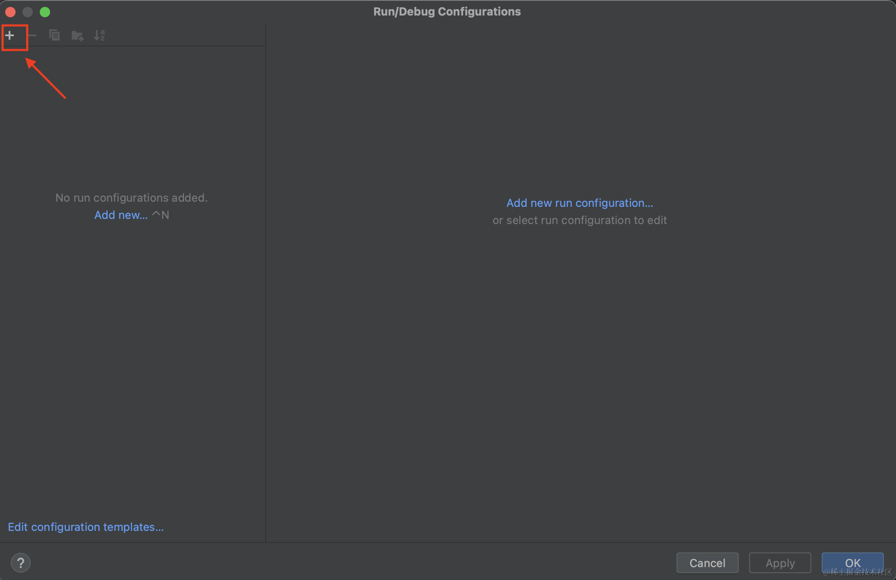

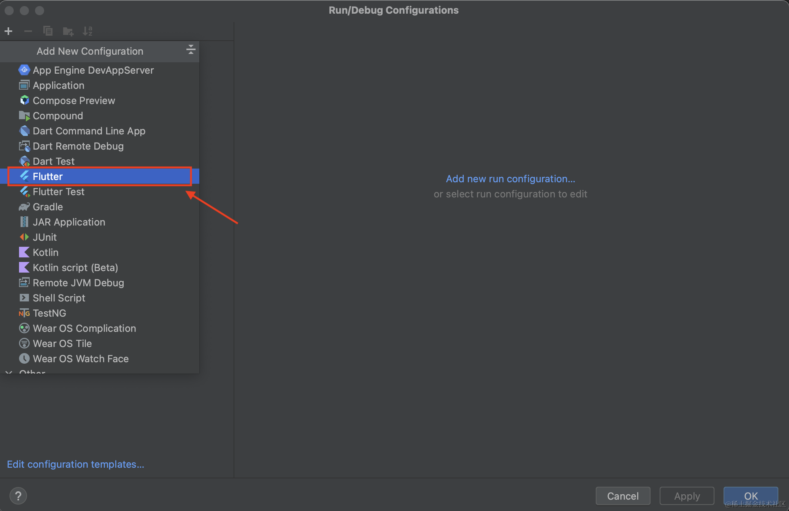

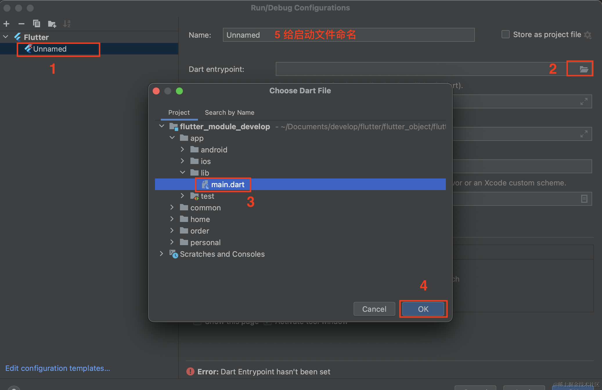

所有模块都是一样的创建流程，最后的效果。


# 4、建立依赖

### 4.1、在common模块的pubspec.yaml中添加相关依赖库

我在这里添加了 `provider` 库；

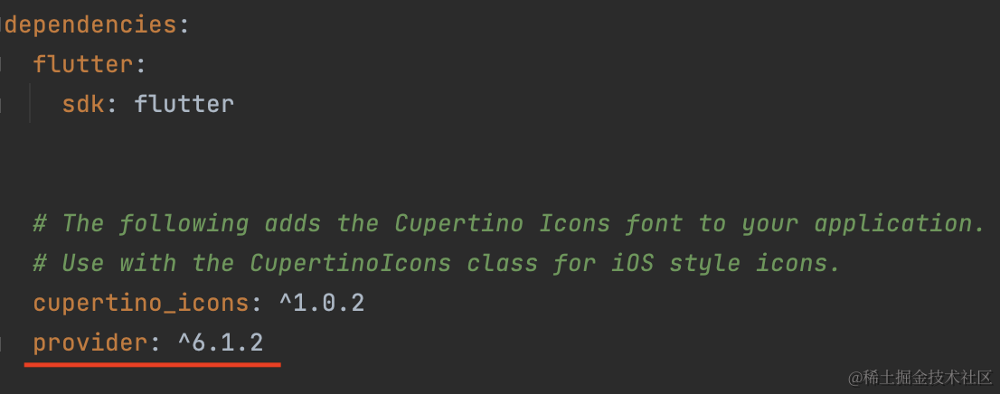

### 4.2、在home、order、personal的pubspec.yaml中添加common模块

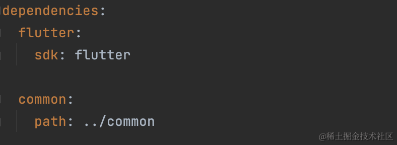

### 4.3、在app模块的pubspec.yaml中添加home、order、personal模块

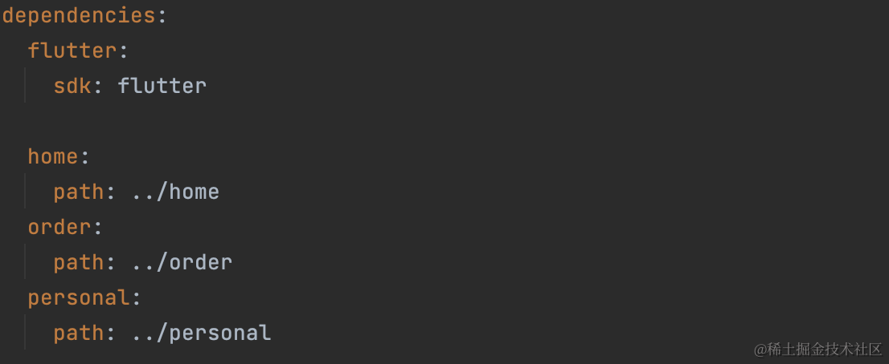

# 5、Provider

在 **common** 模块中声明 **状态**，这样所有模块都可以找到；

```js
import 'package:flutter/cupertino.dart';

class Counter extends ChangeNotifier {
  int count = 0;

  void compute() {
    count++;
    notifyListeners();
  }
}
```

# 6、问题

### 6.1、跨模块无法访问静态资源

我将 **图片**、**字体** 放在 common 模块中，本以为其他模块也可以引用，事实证明**不可以**；

因为它默认找到是**启动模块的包路径**，当前启动的是 app 模块，所以**找不到** common 模块下的本地资源文件；

但我找到了**解决方向**，这些**加载本地资源的Widget**，很多都提供了 package 属性，遗憾的是，我**没有找到正确的使用方式**，如果哪位同学解决了，麻烦评论区留言，目前解决方案，就是每个模块**各管各的**静态资源。

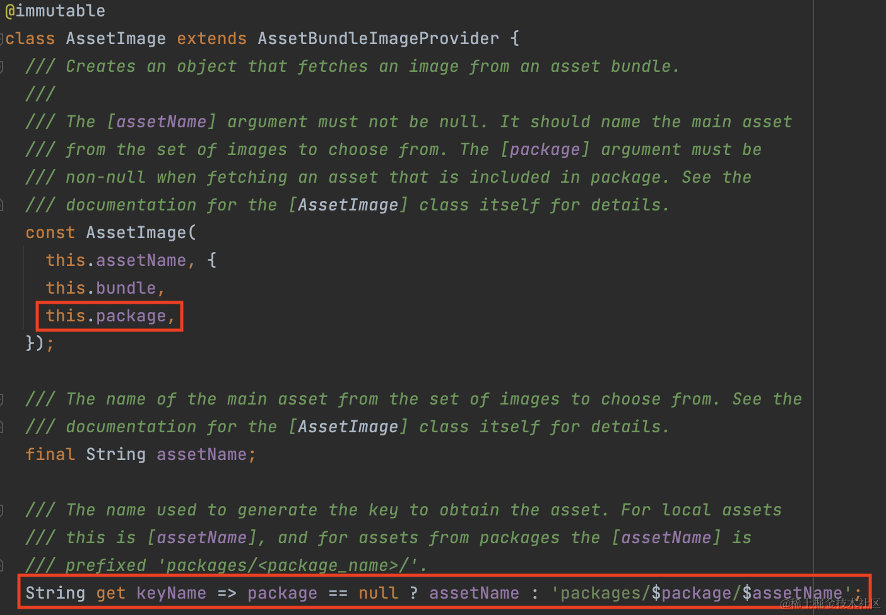

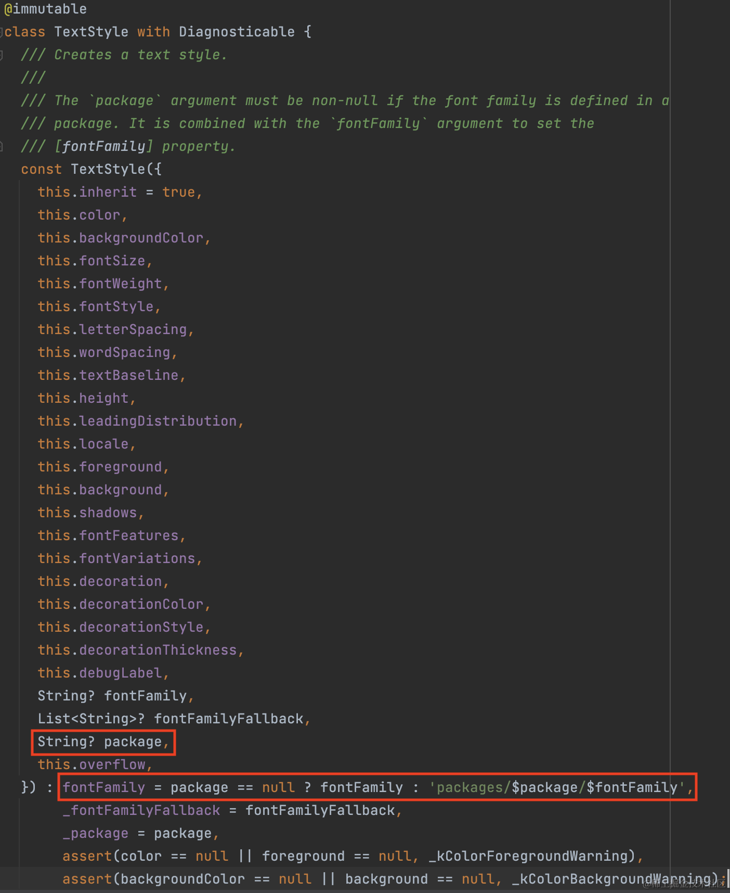

# 7、注意事项

7.1、依赖的模块**发生更改**，**所有关联**的模块，都需要重新 `pub get`，不然找不到**更新的内容**；

7.2、引用依赖模块的对象时，**编译器没有提示**，需要**手动导包** ( import 'xx/xx.dart' ) ，不过好在导包的时候**有提示**；

7.3、Android原生的**gradle**需要**统一版本**，**不仅仅是Android原生**，或者说**所有模块原生平台**的构建工具，都需要**统一版本**，不然可能会出问题；

7.4、Flutter项目，占电脑的**磁盘空间会变大，大2.5倍**，这个应该不是问题，除非是大型游戏项目，几十G，就算翻倍，可以加硬盘解决；

# 总结

### 项目依赖图

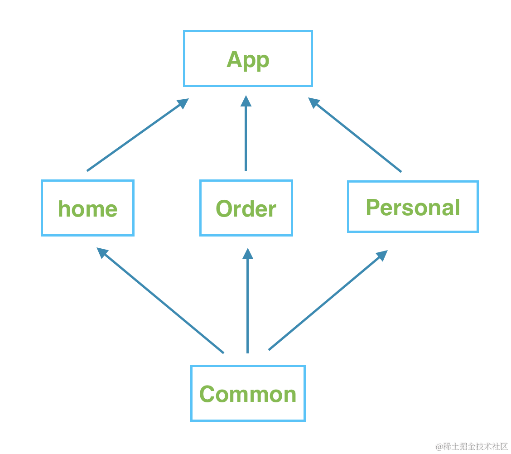

### 效果图

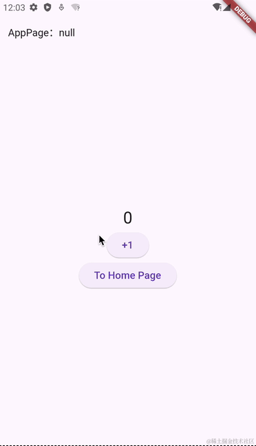

### 打包体积

新建的**单一**Flutter项目，打包体积为 `17.4MB`，而案例中**包含五个**模块的Flutter项目，打包体积为 `17.9MB`，体积**还算合理**。


